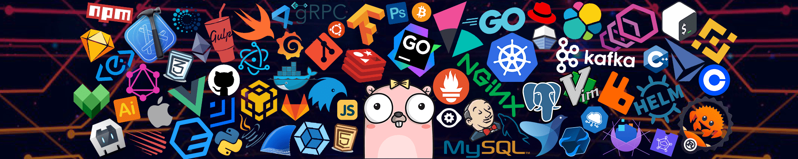

<!--  -->

<!-- <h1 align="center">Hello, I'm Ganpat Hada</h1> -->
<!--   -->

 <h1>Hi, I am 
 <a href="https://mohitpraja.netlify.com" target="_blank">Ganpat Hada</a>
 
  
  
 </h1>

 
 
🙏🏻 Welcome to my Github profile! 
        I am a <b>full stack web developer</b> 🚀 from <b>Rajasthan, India</b>. 
        I love building side projects 😍, and most of them are <b>Open source</b>. 

    

        
          
          
          <a href="" target="_blank">
          
          <a href="" target="_blank">
        <!-- 
        <!-- <a href="https://www.dribbble.com/aromalanil">
    

 
 

<h3>💫 About Me</h3>

I'm a dedicated software developer with a strong foundation in full-stack development. My expertise lies in building responsive and
interactive front-end applications using React, and developing efficient and scalable back-end systems with Express and Java. With
a passion for crafting seamless user experiences and robust server-side solutions, I thrive on solving complex challenges and
contributing to impactful projects. I'm always eager to learn and grow, leveraging my skills to drive innovation and deliver high quality software solutions

- 🌱&nbsp;&nbsp;&nbsp;I’m currently learning **Typescript,Nextjs**.  
- 🔭&nbsp;&nbsp;&nbsp;I like exploring **Web designing**.  
- 📫&nbsp;&nbsp;&nbsp;Ask me about **Art**.  
- ⚡&nbsp;&nbsp;&nbsp;&nbsp;Fun fact: Hello World: The first program many learn to code with.🤓. 

 
<h3> 💻 Tech Stack   </h3>

                     

